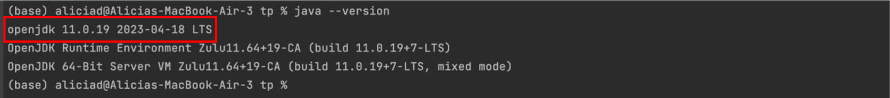

# 🚀 Welcome to Realodex! 🚀

    

**Realodex** is your ultimate client management tool tailored specifically for the **dynamic needs of real estate professionals**. 
Realodex offers seamless functionality to ***add***, ***edit***, ***filter***, and ***delete*** client information efficiently, **optimising and streamlining your day-to-day operations** as real estate agents. 

--------------------------------------------------------------------------------------------------------------------
## Why Choose Realodex?
Realodex is **tailor-made for the real estate industry**, offering **custom tools and features** that align with the everyday workflows of real estate agents. 

- **Enhanced Productivity**: Access and manage your client database efficiently. 
- **Intuitive Interface & Features**: Our user-friendly interface is designed for quick learning, enabling you to navigate and utilise Realodex with ease.
- **Focus on Core Goals**: Allows you to dedicate more time to closing deals and fostering client relationships.

<box type="tip" header = "**New to Realodex?**">
This guide provides detailed documentation on Realodex's features, FAQs, and upcoming updates. <a href="#getting-started">Start</a> enhancing your real estate operations today!
</box>

--------------------------------------------------------------------------------------------------------------------

## Table of Contents

- [Welcome to Realodex!](#welcome-to-realodex)

- [Why Choose Realodex?](#why-choose-realodex)

- [Navigating this User Guide](#navigating-this-user-guide)
     
    - [Formatting Conventions](#formatting-conventions)
  
    - [Icon Legend](#icon-legend)
  
    - [Key Sections](#key-sections)
  
    - [Glossary](#glossary)

- [Getting Started](#getting-started)
   
  - [Downloading Realodex](#downloading-realodex)
   
  - [Introduction to Realodex GUI](#introduction-to-realodex-gui)
   
  - [Realodex Tutorial](#realodex-tutorial)
   
- [Features](#features)
   
    - [Command Format and Usage](#command-format-and-usage)
   
    - [Adding a Client](#adding-a-client-add)
   
    - [Deleting a Client](#deleting-a-client-delete)
   
    - [Editing a Client](#editing-a-client-edit)
   
    - [Filtering Clients](#filtering-clients-filter)
   
    - [Listing Clients](#listing-clients-list)
   
    - [Sorting Clients](#sorting-clients-sort)
   
    - [Clearing Realodex](#clearing-realodex-clearrealodex)
   
    - [Help](#help-help)
   
    - [Help (Individual Commands)](#help-individual-commands-command-help)
   
    - [Exiting the Program](#exiting-the-program-exit)
   
    - [File Data](#file-data)
   
- [Field Constraints](#field-constraints)
   
- [Command Summary](#command-summary)
   
- [FAQ](#faq)
   
- [Known Issues](#known-issues)

--------------------------------------------------------------------------------------------------------------------
## Navigating this User Guide
**Welcome** to the Realodex User Guide! 
We hope this user guide empowers you with the knowledge and confidence to **unleash the full potential of Realodex**.
To ensure you have a **smooth and intuitive experience**, we recommend you to familiarise yourself with the **specific formatting conventions and icons** that this guide uses. 

#### Formatting Conventions
| Format        | Meaning                                                                                                                                                                                                                |
|---------------|------------------------------------------------------------------------------------------------------------------------------------------------------------------------------------------------------------------------|
| **Bold**      | Used to **draw attention** to key concepts and actions you need to perform. When you see text in bold, it emphasises **important information.**                                                                        |
| _Italics_     | Reserved for introducing _new terms and phrases_ that are essential to understanding Realodex. Italicized text may also appear in subheadings beneath screenshots to succinctly describe what you're seeing in the image. |
| `Code blocks` | Actual commands that you may run in Realodex will be referred to in these code blocks.                                                                                                                              |

#### Icon Legend
<box type="tip">

These boxes provide **useful tips and tricks** on how to optimise Realodex</box>
<box type="info">

These boxes provide **important things to note** when using Realodex</box>
<box type="warning">

These boxes provide **precautionary warnings** to **avoid potential pitfalls**</box>
<box type="wrong">

These boxes **highlight error messages** and critical failure information</box>

#### Key Sections
This guide also includes:
- **Effortless Navigation**: Seamlessly navigate between sections using the [Table of Contents](#table-of-contents).
- **Getting Started for New Users**: If you are new to Realodex, begin your journey by exploring our [Getting Started Guide](#getting-started), which provides comprehensive instructions to set up Realodex.
- **Tutorial**: Dive into a detailed, step-by-step walkthrough of Realodex’s features in our [Tutorial](#realodex-tutorial) section.
- **Features**: Discover and learn how to utilize all the functionalities of Realodex in our detailed [Features](#features) section.
- **FAQ**: Find answers to common questions and helpful tips in the [FAQ](#faq) section.

#### Glossary

This table provides **definitions** of **key terms and abbreviations** used throughout the Realodex user guide.

| Abbreviation/Nomenclature      | Meaning                                                                                                                                                                  |
|--------------------------------|--------------------------------------------------------------------------------------------------------------------------------------------------------------------------|
| GUI (Graphical User Interface) | The **digital interface** through which you interact with Realodex.                                                                                                      |
| CLI (Command Line Interface)   | A **text-based interface** that allows users to interact with the application using commands typed into a command prompt or terminal.                                    |
| Command                        | An **instruction** given by the user that prompts Realodex to perform a specific action. See the [Command Summary](#command-summary) for more details.                   |
| Prefix                         | Initial parts of commands in Realodex that **specify the type of information** to follow (e.g., `n/` for name). View our [Prefix Summary](#prefix-summary) for more details. |
| Case-Sensitive                 | Indicates that the casing of letters **matters**; for example, “ReAlOdEx” would be recognized differently from “realodex”.                                                   |
| Case-Insensitive               | Indicates that the casing of letters **does not affect** how they are interpreted; “ReAlOdEx” and “realodex” would be treated as the same.                                   |
| Command Prompt                 | A command line interpreter application available in most Windows operating systems. It allows users to **execute commands** and scripts.                                     |
| Terminal                       | The command line interface used in **Unix and MacOS** systems, allowing users to execute commands and scripts similar to Command Prompt in Windows.                          |
| JSON File                      | The file format Realodex uses to **store client data.**                                                                                                                      |

--------------------------------------------------------------------------------------------------------------------

## Getting Started

### Downloading Realodex

<tabs>
<tab header="Windows">

1. **Check Java Installation**:

   a. Open _command-prompt_ by typing `cmd` in your Windows start menu.

   b. Type `java --version` in the command-prompt and press enter to **check if Java is installed** and is the **correct version**.
   Please see below for the expected output if the correct version of Java is installed.
   The red box indicates the expected Java version you should see.
    
      

        
      

   
   c. If Java is not installed or the wrong version is installed,
      **please install Java 11** from [here](https://www.oracle.com/sg/java/technologies/javase/jdk11-archive-downloads.html).

</tab>
<tab header="Mac/Linux"> 

1. **Check Java Installation**:

   a. Open _Terminal_.

   b. Type `java --version` and press enter to **check if Java is installed** and to the **right version**.
   Below image is the expected output if the correct version of Java is installed.
   The red box indicates the expected Java version you should see.
    
      

        
      

   c. If Java is not installed or the wrong version is installed, 
        **please install Java 11** from the official site or click [here](https://www.oracle.com/sg/java/technologies/javase/jdk11-archive-downloads.html).

</tab>
</tabs>

2. **Create a New Folder**: On your desktop, **create a new folder** titled "Realodex". This will be the dedicated location for **storing the Realodex application** and its associated files.

3. **Download Realodex**:
   Download the **latest version** of `realodex.jar` from the [official release page](https://github.com/AY2324S2-CS2103T-W10-1/tp/releases). Below is an image of what the download page looks like:
       
      

        
      

       

4. **Set Up Realodex**:
   Copy the downloaded `realodex.jar` file to the newly created **"Realodex" folder on your desktop**. This helps to keep your application organized and prevents potential conflicts with files from other applications.

5. **Navigate to Workspace**: 

    a. Open a **command terminal**.
    
    b. Enter the following command: `cd Desktop/Realodex`. You may refer to the screenshot below.
       
  

    
  

 

6. **Run Realodex**: Now enter `java -jar realodex.jar` to **run the application**.
    
  

    
  

 

You should see a _GUI_ similar to image below pop up.
    
  

    
  

 

---

### Introduction to Realodex GUI

Realodex features a GUI crafted to deliver a **seamless user experience**. 
The GUI is structured into several distinct components, each designed to **enhance your interactions and efficiency**.

#### Client Profile

---

### Realodex Tutorial
**Welcome** to your first session with Realodex.
We've designed this tutorial to **help new users familiarize themselves** with the functionality and flow of the application. 
Follow along to get a feel of how Realodex works. Let's begin!

1. **Starting Realodex.** Launch Realodex. The app will show up as follows:
   

<box type="info" header="Notes">

- If this is your first time, some **sample entries** will be loaded for you.
</box>

2. **Adding a client.** Let us try to **add a new client** into Realodex. Run the following command:
`
add n/John Doe p/98765432 i/20000 e/johnd@example.com a/311, Clementi Ave 2, #02-25 f/4 t/buyer t/seller h/HDB r/Has 3 cats b/01May2009
`

   

New client John Doe has now been added!

 

**Congratulations**, you have just added your first ever client into Realodex!

<box type="tip" header="Tip">

  - Try adding new clients with **different parameters** to familiarise yourself with the add command.
</box>

3. **Filter clients.** Notice that the list may start to feel a bit crowded as more clients are added. 
We can utilise the filter feature to **efficiently locate specific clients**. 
Let's search for our new client John, by simply keying in the command: `filter n/John`.

   

The filter command outputs our new client John Doe.

<box type="tip" header="Tip">

- You may filter by **name** but also by **remarks, housing type preference**, and even **birthdays**.
  </box>

 

4. **Listing all clients.** We are now done reviewing John Doe's details. 
Let us **view the entire client list** again. To do this, simply enter the command: `list`.

The list command outputs the entire client list.

 

5. **Editing clients.** Suppose our new client John Doe has gotten a pay raise! Let's **edit** his income to **reflect this change**. 
First, let's take note of his **index number in the client list**.
   
    

Since John's index number is 7, enter the command `edit 7 i/88888`. 
   

The edit command modifies John Doe's income to 88888.

    

<box type="tip" header="Tip">

- You may also **edit multiple fields** of a client at once.
  </box>

6. **Deleting a client.** 
We can also **remove client profiles** from Realodex. 
Let us try deleting John Doe from the Realodex by entering `delete n/John Doe`. 
   

The delete command deletes client John Doe with a successful deletion message.

    

<box type="info" header="Notes">

- Notice that the client list has been **automatically modified** after John's deletion, with the last client now being Roy.
</box>

  7. **Getting Help.** Should you **need assistance** on any of the commands at anytime while using Realodex, simply enter the `help` command.
     

A help window is displayed explaining each command usage.

      

For specific **guidance on individual commands**, you can also enter `COMMAND help`.
Let's try it out with `delete help`. 
     

A message on the delete command usage will be shown.

      

**Congratulations**! You have finished the Realodex tutorial and are now ready to use Realodex. 
Feel free to **continue exploring the in-depth features** of Realodex to fully leverage its capabilities in your real estate operations!

## Features

### Command Format and Usage

Understanding the **command format** in Realodex is crucial for effectively managing your client data. Here are the key aspects of our command structure:

**General Command Structure:**

Commands typically follow this format: `COMMANDWORD PREFIX_ONE/UPPER_CASE PREFIX_TWO/UPPER_CASE ....` This structure helps in **executing specific actions** within the application.

**Command Words:**

`COMMANDWORD` refers to the **base commands** that the user can input, such as `add`, `delete`, `filter`. These commands are _case-insensitive_, meaning both `add` and `ADD` will perform the addition operation.

**Prefix Usage:**

`PREFIX/` tags are used to **specify the type of data being entered**. For example, in `add n/John Doe p/98765432`, `n/` stands for name, and `p/` stands for phone number. Like command words, prefixes are also case-insensitive (`n/` and `N/` are treated the same).

**Parameter Input:**

Parameters must follow the prefix they are associated with and are typically in `UPPER_CASE` in documentation to indicate where **user-supplied data should be inserted**. For instance, in the command `add n/NAME`, `NAME` is where you would place the actual name of the client.

</box>

### Adding a client: `add`

**Adds a client** to Realodex.

**Format:**
<box>

`add n/NAME p/PHONE i/INCOME e/EMAIL a/ADDRESS f/FAMILY t/TAG h/HOUSING_TYPE [r/REMARK] [b/BIRTHDAY]`
</box>

<box type="info" header="Notes">

  * `n/NAME`,`p/PHONE`,`i/INCOME`,`e/EMAIL`,`a/ADDRESS`,`f/FAMILY`,`t/TAG` and `h/HOUSING_TYPE` are compulsory fields.
    * If any of the above fields are missed out in the `add` command, you will receive an error message informing you of the compulsory fields that you missed. 
      * For example, if only `n/NAME` and `i/INCOME` are present, you will be alerted that you are missing the fields `p/PHONE`,`e/EMAIL`,`a/ADDRESS`,`f/FAMILY`,`t/TAG`and`h/HOUSINGTYPE`.

  * There can only be **one of each field** in the add command except for `t/TAG` which accepts **up to 2 tags**. 
    * For example, if only `n/NAME` and `i/INCOME` are present, you will be alerted that you are missing the fields `p/PHONE`,`e/EMAIL`,`a/ADDRESS`,`f/FAMILY`,`t/TAG`and`h/HOUSINGTYPE`. 
    * Except `t/TAG`, there can only be one of each field in the add command.

- For `t/TAG`, you may input both `t/BUYER` and/or `t/SELLER` (case insensitive).
  - If either tag is repeated more than once, for e.g. `t/BUYER t/BUYER`, the tag will only be recorded once and no error will be thrown.
- `r/REMARK` and `b/BIRTHDAY` fields are optional, enclosed in `[]`. You may choose to omit them.
  - If you include the prefix with a blank input, the birthday and remark fields will be taken as not specified.
    - Example: `add n/John Doe p/98765432 i/20000 e/johnd@example.com a/311, Clementi Ave 2, #02-25 f/4 t/Buyer h/HDB r/ b/` will successfully add John Doe but remarks and birthday will be not specified.
</box>

<box type="warning" header="Caution">

- Each field has constraints to the inputs it can accept. Do refer to the [Field Constraints](#field-constraints) for more information.
    - If any of the constraints are violated, you will receive an error message detailing the fields with invalid formats.
    - For example, if `n/NAME`,`p/PHONE` and `t/TAG` fields do not fulfil the contraints, you will receive 3 error messages as shown.
- You **cannot** have duplicate persons with the same name in Realodex.
    - Names are case-insensitive as described in [Field Constraints](#field-constraints).
    - If you try to add duplicate persons, you will get the error message "This client already exists in Realodex".

</box>

<box type="wrong" header="Error">

* `n/NAME`,`p/PHONE`,`i/INCOME`,`e/EMAIL`,`a/ADDRESS`,`f/FAMILY`,`t/TAG` and `h/HOUSING_TYPE` are **compulsory fields**.
    * If you missed out any of the fields mentioned above, you will be notified with an error message **indicating the overlooked fields**.
</box>

[//]: # (- For `t/TAG`, you may input both `t/BUYER` and/or `t/SELLER` &#40;case insensitive&#41;.)

[//]: # (  - If either tag is repeated more than once, for e.g. `t/BUYER t/BUYER`, the tag will only be recorded once and no error will be thrown.)

[//]: # (- Note that the `r/REMARK` and `b/BIRTHDAY` fields are optional, enclosed in `[]`. You may choose to omit them.)

[//]: # (  - If you include the prefix with a blank input, the birthday and remark fields will be taken as not specified.)

[//]: # (    - Example: `add n/John Doe p/98765432 i/20000 e/johnd@example.com a/311, Clementi Ave 2, #02-25 f/4 t/Buyer h/HDB r/ b/` will successfully add John Doe but remarks and birthday will be not specified.)

[//]: # (- Each field has constraints to the inputs it can accept. Do refer to the [Field Constraints]&#40;#field-constraints&#41; for more information.)

[//]: # (  - If any of the constraints are violated, you will receive an error message detailing the fields with invalid formats.)

[//]: # (  - For example, if `n/NAME`,`p/PHONE` and `t/TAG` fields do not fulfil the contraints, you will receive 3 error messages as shown.)

[//]: # (    <a href="parsing_errors.png">)

[//]: # (    )

[//]: # (    </a>)

[//]: # (- You **cannot** have duplicate persons with the same name in Realodex.)

[//]: # (  - Names are case-insensitive as described in [Field Constraints]&#40;#field-constraints&#41;.)

[//]: # (  - If you try to add duplicate persons, you will get the error message "This client already exists in Realodex".)

[//]: # (    <a href="images/add-command/duplicate_person_error.png">)

[//]: # (    )

[//]: # (    </a>)

**Example**:

`add n/John Doe p/98765432 i/20000 e/johnd@example.com a/311, Clementi Ave 2, #02-25 f/4 t/Buyer h/HDB r/Owes $1000. b/27May2003`

  
John Doe has been added into Realodex.

 

[Back to Table of Contents](#table-of-contents)

--------------------------------------------------------------------------------------------------------------------

  
### Deleting a client : `delete`

**Deletes the specified client** from Realodex. There are 2 ways to do so:

#### Delete By Name

Deletes the client with the specified `NAME`.

**Format:**
<box>

`delete n/NAME`
</box>

<box type="info" header="Notes">

* Deletes the client with the specified `NAME` in Realodex.
* `NAME` is case-insensitive.
* If `NAME` is **not found**, error message will be shown "The client name provided is invalid".

</box>

**Example:**

`delete n/John Doe` deletes the client in Realodex with the name "John Doe".

  
  <em> Client list before entering command <code>delete n/John Doe</code></em>

  
  <em> Client list after entering command <code>delete n/John Doe</code></em>

<box type="wrong" header="Error">

If there is **no client with the specified** `NAME` in the current list, an **error message** will be shown: "The client name provided is invalid".  
</box>

#### Delete By Index

Deletes the client of the specified `INDEX`.

**Format:**
<box>

`delete INDEX`
</box>
<box type="info" header="Notes">

* Deletes the client of the specified `INDEX` in Realodex.
* 💡 If you are currently filtered, the index will be based on the filtered list.
* If `INDEX` is **more than the number of clients in Realodex**, error message will be shown "The client index provided is invalid."
  to indicate that this client index does not exist.
    * This does not apply to unrealistic index values of >= `2147483648` which results in integer overflow as expected
      and will no longer be interpreted as a non-zero unsigned integer.
      Hence, below error message applies.

</box>

<box type="wrong" header="Error">

- If `INDEX` is a **non-zero unsigned integer**, error message will be shown "Index is not a non-zero unsigned integer."
- If there is no client with the specified INDEX in the current list, an error message will be shown: "The client index provided is invalid".
- If neither index nor name is provided `delete` will show an error message "Please provide either an index or a name."
- If both an index and name is provided `delete INDEX n/NAME` will show an error message "Please provide either an index or a name, not both."
- If both an index and name is provided `delete n/NAME INDEX ` will show an error message "The client name provided is invalid" as INDEX is considered part of the NAME."

</box>

**Example:**

`delete 3` deletes the 3rd client listed in Realodex, provided there are 3 or more entries.

  
  <em> Client list before entering command <code>delete 3</code></em>

  
  <em> Client list after entering command <code>delete 3</code></em>

[//]: # (<box type="info" header="">)

[//]: # ()
[//]: # (* If `INDEX` is **more than the number of clients in Realodex**, error message will be shown "The client index provided is invalid."  )

[//]: # (* If 'INDEX` is a non-zero unsigned integer, error message will be shown "Index is not a non-zero unsigned integer."  )

[//]: # (</box>)

[Back to Table of Contents](#table-of-contents)

--------------------------------------------------------------------------------------------------------------------

### Editing a client : `edit`

**Edits specified details** of the client.

**Format:**
<box>

`edit INDEX [n/NAME] [p/PHONE] [i/INCOME] [e/EMAIL] [a/ADDRESS] [f/FAMILY] [t/TAG] [h/HOUSINGTYPE] [r/REMARK] [b/BIRTHDAY]`
</box>

<box type="info" header="Notes">

- If `INDEX` is `3`, the 3rd client's information will be edited.
- If `INDEX` is a **non-zero unsigned integer**, error message will be shown "Invalid command format..."
- If you currently have a filtered list after `filter` operations,
  the index will be based on the filtered list.
- It is optional to edit any field (i.e, you can choose to edit any combination of fields so long there is **at least 1**).
- All fields must follow the respective [Field Constraints](#field-constraints).

</box>

<box type="warning" header="Caution">

- The current information will be overwritten with the input provided. 
- When editing the `TAG`, all existing tags will be overwritten with the new tag(s) provided. If you want to edit the client to be both a buyer and seller, include both tags i.e. `t/Buyer t/Seller`.
</box>
<box type="wrong" header="Error">

- If `INDEX` is **more than the number of clients in Realodex**, error message will be shown "The client index provided is invalid."
  to indicate that this client index does not exist.
    * This does not apply to unrealistic index values of >= `2147483648` which results in integer overflow as expected
      and will no longer be interpreted as a non-zero unsigned integer.
      Hence, below error message applies.
</box>
  
**Example:**

- edit 1 p/999 will overwrite the 1st client's phone number to "999".
- `edit 2 n/Kylie  i/3333 f/5` will change the 2nd client's name to "Kylie", income to "3333" and family size to "5".

  
  <em> Client list before entering command <code>edit 2 n/Kylie  i/3333 f/5</code></em>

  
  <em> Client list after entering command <code>edit 2 n/Kylie  i/3333 f/5</code></em>

[Back to Table of Contents](#table-of-contents)

--------------------------------------------------------------------------------------------------------------------

### Filtering clients: `filter`

The filter command in Realodex allows you to **narrow down your list** of clients by **one** specified field. 
Currently, we support **filtering by name, remark, tag, birthday month, or housing type**.

<box type="info" header="Notes">

- When performing multiple filter operations in sequence, each new filter is applied to the original, full list of clients, not the subset produced by the previous filter. This approach ensures clarity and consistency in search results.
- Note that the search is case-insensitive for all input parameters.
</box>

<box type="tip" header="Tip">

  - Regular use of the filter command can significantly **streamline** your client management processes!
</box>

#### Filter By Name
Returns the list of only the clients whose **names contain the specified keyphrase**.

**Format:**
<box>

`filter n/KEYPHRASE`
</box>

<box type="info" header="Notes">

* Partial fragments of names will still be matched. 
  * `filter n/Udh` matches a person with the name "Udhaya". 
* Comprehensive searching, returning all persons with names containing the keyphrase. 
  * `filter n/Al` returns persons named "Alicia", "Allysa", "Jamal".
</box>

<box type="warning" header="Caution">

* Keyphrase input should be in valid format for names (alphanumeric) and non-empty.
</box>

**Example:**

`filter n/Li` will return a list of clients whose names contain "li".
 

    
    <em> "Charlotte Oliveiro" and "David Li" are returned.</em>

 

#### Filter By Tag
Returns the list of clients with the **specified tag(s)**.

**Format:**
<box>

`filter t/TAG`
</box>

<box type="info" header="Notes">

- **Filtering by Single Tag**: Filtering by a single tag displays all clients who have that tag. 
This **includes** clients who may have **both "Buyer" and "Seller" tags.**
- **Filtering by Multiple Tags**: Realodex supports filtering by **multiple tags**.
Entering `filter t/Buyer t/Seller` will show only clients who are **tagged as both "Buyer" and "Seller"**.
- **Comprehensive searching**, returning all persons' with the specified tag(s).
  </box>

<box type="warning" header="Caution">

- Tag input should be **valid** and **non-empty** - "Buyer" or "Seller".
    - `filter t/buyer` matches person with tag "Buyer".
- **Inclusive matching** of persons with multiple tags, as long as they possess the
  tag(s) specified in the input.
    - `filter t/buyer` matches person with tags "Buyer" and "Seller".

</box>

**Examples:**

`filter t/seller` will return a list of clients tagged as "Seller".

    
    <em>Clients with "Seller" tag are returned.</em>

---

`filter t/buyer t/seller` will return a list of clients tagged as both "Buyer" and "Seller". 

    
    <em>Clients with both "Buyer" and "Seller" tags are returned.</em>

#### Filter By Housing Type
Returns the list of clients with the **specified preferred housing type**.

**Format:**
<box>

`filter h/HOUSING_TYPE`
</box>
<box type="info" header="Notes">

* **Comprehensive searching**, returning all persons with the specified housing type.
    - `filter h/Condominium` returns all persons with the "Condominium" preferred housing type.

</box>
<box type="warning" header="Caution">

- Housing Type input should be valid and non-empty - "HDB", "Condominium", "Landed Property" or "Good Class Bungalow".
    - `filter h/hdb` matches person with housing type "HDB".
</box>
  
**Example:** 

`filter h/Good Class Bungalow` will return a list of clients with a housing type preference for "Good Class Bungalow".

    
    <em>Clients with housing preference of "Good Class Bungalow" are returned.</em>

#### Filter By Remark
Returns the list of clients whose **remarks include** the **specified keyphrase**.

**Format:**

<box>

`filter r/KEYPHRASE`
</box>

<box type="info" header="Notes">

- **Partial fragments** of remarks will still be matched.
    - `filter r/hand` matches person with remark "handsome".
- **Comprehensive searching**, returning all persons' names containing the keyword .
    - `filter r/love` returns persons with remarks "loves to travel", "has a lovely dog".
</box>

<box type="warning" header="Caution">

- Keyphrase input should be **non-empty**. This is an intentional design choice to ensure that the command is used for targeted searches, preventing the potential misinterpretation of an empty keyphrase as a request to list all clients.
- The remarks for the `filter r/` command **must not contain any other prefixes** to prevent parsing errors.
</box>

<box type="wrong" header="Error">

- The command `filter r/ my tag is t/buyer` would cause an error because the system interprets `t/` as the start of a new prefix.
- To avoid this, ensure that the remark does not contain any spaces followed by slashes that could be misconstrued as additional prefixes.
</box>

**Example:**

`filter r/eat` will return a list of clients with remarks containing "eat".

    
    <em>Clients with remarks like "Eats alot" and "Likes to eat nasi lemak" are returned.</em>

#### Filter By Birthday Month
Returns the list of clients whose **birthdays** fall in the **specified month**.

**Format:**

<box>

`filter b/MONTH`
</box>

<box type="info" header="Notes">

- Month input should be a valid month in **3-letter abbrieviation (MMM)** format and **non-empty**.
  - E.g., "Jan" for January, "Feb" for February 
  - Filtering by month "September" should be `filter b/Sep`
    - `filter b/SEP` matches all people with Birthday in September.
- Month input will also accept extraneous input, i.e. if the first 3 characters are any valid month, it will be valid. 
  - E.g., This forgiving behavior allows you to type in `filter b/AprMogger` and Realodex will interpret the month as April!
- **Comprehensive searching**, returning all persons with birthdays in the specified month.
    - `filter b/Jan` returns all persons with birthday in January.
</box>

<box type="warning" header="Caution">

- Persons who do not have a specified birthday will **not be included** in the search results.
</box>

<box type="wrong" header="Error">

- if the extraneous input is the **same birthday prefix with spaces before** it,
  `e.g. filter b/Sep b/mog` as that will be considered as **duplicate birthday prefixes.**
</box>

**Example:**

`filter b/Apr` will return a list of clients with birthdays in April.

    
    <em>Clients with birthdays in April are returned.</em>

[Back to Table of Contents](#table-of-contents)

--------------------------------------------------------------------------------------------------------------------

### Listing clients : `list`

Lists all clients in Realodex.

**Format:**
<box>

`list` 
</box>

<box type="tip" header="Tip">

- Use the `list` command to **clear any active filters** and view all clients again.
  </box>

[Back to Table of Contents](#table-of-contents)

--------------------------------------------------------------------------------------------------------------------

### Sorting Clients : `sort`

This feature **organises clients** based on **how soon their next birthday** will occur, relative to the current date. 

**Format:**
<box>

`sort`
</box>

<box type="info" header="Notes">

* The current date is based on the local system's time. 
* If their birthday has already passed, the calculation is based on the number of days until their next birthday next year.
</box>

<box type="warning" header="Warning">

* If the list presented is currently a filtered list after using [filter](#filtering-clients-filter), sort will work on the new filtered list.
* If a birthday falls on February 29th (leap day), the day calculation is based on March 1st if the year does not have a leap date as realistically, most would still celebrate every year.
</box>

**Example**

`sort` will return a new sorted list of clients by their upcoming birthday.

    
    <em>Client list is sorted by upcoming birthday.</em>

[Back to Table of Contents](#table-of-contents)

--------------------------------------------------------------------------------------------------------------------

### Clearing Realodex : `clearRealodex`

**Clears all existing clients** in Realodex, returning an **empty client list**.

**Format:**
<box>

`clearRealodex`
</box>

<box type="tip" header="Notes">

- A longer command, <code>clearRealodex</code>
is used so that users understand that this command <b>clears all entries in Realodex</b>,
**preventing potential confusion** with the **delete** command and **accidental clearing** of all entries.
</box>

<box type="warning" header="Warning">

- Be careful when using <code>clearRealodex</code>, you will **not be able to undo** this operation!
</box>

**Example:**

Upon running `clearRealodex`, Realodex will clear and return an empty client list.

    
    <em>Client list is now empty.</em>

[Back to Table of Contents](#table-of-contents)

--------------------------------------------------------------------------------------------------------------------

### Help : `help`

Generates a pop-up window, which is a summarized version of the User Guide and **feature descriptions**.

**Format:**
<box>

`help`
</box>

<box type="tip" header ="Tip">

The help window can also be accessed by the **"Help" button on the top menu**.
</box>

**Example:**

Upon running `help`, **a help window will pop up** together with a success message.

    
    <em>The Help Window.</em>

[Back to Table of Contents](#table-of-contents)

--------------------------------------------------------------------------------------------------------------------

### Help (Individual Commands) : `COMMAND help`

Displays the **help message** for the **specified command** only.

**Format:**
<box>

`COMMAND help`
</box>

<box type="info" header="Notes">

* Note that this feature is only available for the `add`,`clearRealodex`,`delete`,`edit`,`filter`,`list` and `sort` commands.

* Although the format is `COMMAND help`, the exception is the help message for the clear command, use `clear help` instead of `clearRealodex help`.
  </box>

<box type="warning" header="Warning">

- Any other valid command followed by `help` that is not included in this feature will simply execute the command as per normal.
</box>

**Example:**
`add help` returns the help message for `add` command as shown below.

    
    <em>The help message for the add command.</em>

[Back to Table of Contents](#table-of-contents)

--------------------------------------------------------------------------------------------------------------------

### Exiting the program : `exit`

**Exits the program** and closes the window.

**Format:**
<box>

`exit`
</box>

<box type="info" header="Notes">

* Note that keying in `exit` followed by any random string, such as `exit wrelvwrvn` will also cause the app to exit.
  </box>

[Back to Table of Contents](#table-of-contents)

--------------------------------------------------------------------------------------------------------------------

### File Data

The _JSON file_ that **stores the data** of your contacts can be found in a folder named `data`, in the **same folder/directory as the Realodex app**. 

(e.g. if you have Realodex installed in your Desktop, the `data` folder containing the file can be found in your Desktop as well.)

#### Saving Data

Realodex **data is saved** in the hard disk as a JSON file **automatically** after any command that modifies it. There is **no need for manual saving**.

#### Editing Data

Realodex data is **saved automatically** as a JSON file `[JAR file location]/data/realodex.json`. Advanced users may choose to **modify this file directly** to update data.

<box type="warning" header="Caution">

- **Invalid Format**: If manual changes to the data file result in an invalid format, Realodex will **discard all data** and start with an **empty data file** on the next run. 
It is strongly recommended to **make a backup of the file** before making any edits.
- **Unexpected Behavior**: **Incorrect edits** may cause Realodex to behave unpredictably, for instance, if a value **outside the acceptable range** is entered.
- **Proceed With Caution**: Only edit the data file if you are **confident in your ability** to maintain its correct format.
</box>

#### Restarting with New Data
You may want to **re-enter your client data in a fresh JSON file** in the event of file corruption or a bad edit which caused the format to be incorrect:

1. **Delete the `realodex.json` file**, which can be found in the data folder
2. **Restart** the Realodex application. 
3. A **new JSON file with sample contacts** will be generated and you may proceed from there.

--------------------------------------------------------------------------------------------------------------------

## Field Constraints
Summarized in the table below are the attributes of a client along with their constraints. These constraints are **important** and **should be adhered** to when performing Realodex functions!

| Format                                                                | Constraints                                                                                                                                                                                                                                                                                                                                                                                                                                                                                                                                                                                                                                                                                                                                                                                                                                                           | Example                                                                                                               |
|-----------------------------------------------------------------------|-----------------------------------------------------------------------------------------------------------------------------------------------------------------------------------------------------------------------------------------------------------------------------------------------------------------------------------------------------------------------------------------------------------------------------------------------------------------------------------------------------------------------------------------------------------------------------------------------------------------------------------------------------------------------------------------------------------------------------------------------------------------------------------------------------------------------------------------------------------------------|-----------------------------------------------------------------------------------------------------------------------|
| `n/Name`                                                              | <ul><li>Should only contain alphanumeric characters and must be unique.</li><li>While we disallow <code>s/o</code> as <code>/</code> is used as a command delimiter, a simple and reasonable workaround is to use alternatives such as <code>s o</code> or <code>son of</code>.</li><li>Names are case-insensitive.</li><li>Number of spaces between words in the name do not matter. (Example: <code>n/John Doe</code> and <code>n/john   doe</code> are both considered the same valid name and both will be displayed as <code>JOHN DOE</code>.)</li><li>Although names are displayed in full capitalisation, they are still recorded in a case-insensitive manner. Hence, an input with the same name but different capitalisation will be considered a duplicate entry.</li></ul>                                                                                | <ul><li>✅ <code>n/John Doe</code></li><li>✅ <code>n/JoJo Siwa 1</code></li><li>❌ <code>n/Han$el</code></li></ul>      |                                                                                                                                                                                                                                                                                                                                                                                                                                                                                                                                                                                                                                                                                                                                                                                        |                                                                                                      |
| `p/Phone`                                                             | <ul><li>Should only contain numbers, and should be at least 3 digits long.</li><li>While we disallow usage of symbols such as +, if you wish to use country codes, a reasonable work-around is to omit using of symbols. E.g., to input +6590215365 you may simply type in 6590215635</li><li>Spaces are also not allowed. However, a simple work-around for this is to omit using such spaces. E.g. to input 9021 5365 we can simply type in 90215365.</li></ul>                                                                                                                                                                                                                                                                                                                                                                                                     | <ul><li>✅ <code>i/1234</code></li><li>❌ <code>i/123A</code></li></ul>                                                 |                                                                                                                                                                                                                                                                                                                                                                                                                                                                                                                                                                                                                                                                                                                                                                                        |                                                                                                                  |
| `i/Income`                                                            | <ul><li>**Integer** and should be **at least 0**. </li></ul>                                                                                                                                                                                                                                                                                                                                                                                                                                                                                                                                                                                                                                                                                                                                                                                                          | <ul><li>✅ <code>i/10000</code></li><li>❌ <code>i/10,000</code></li><li>❌ <code>i/-1</code></li></ul>                  |
| `e/Email`                                                             | <ul><li>Emails should be of the format local-part@domain.</li><li>The local-part should only contain alphanumeric characters and these special characters: +_.- (excluding parentheses).</li><li>The local-part may not start or end with any special characters.</li><li>This is followed by a '@' and then a domain name, made up of domain labels separated by periods.</li><li>The domain name must end with a domain label at least 2 characters long.</li><li>Each domain label must start and end with alphanumeric characters.</li><li>Each domain label may consist of alphanumeric characters, separated only by hyphens, if any.</li><li>Top-level domain (TLD) such as .com are not compulsory, as according to Internet Protocol Standards (<a href="https://datatracker.ietf.org/doc/html/rfc5322#section-3.4.1">RFC 5322 Section 3.4.1</a>).</li></ul> | <ul><li>✅ <code>e/admin@realodex</code></li><li>❌ <code>e/hello@x_mail</code></li></ul>                               |
| `a/Address`                                                           | <ul><li>Must not include other command prefixes (`a/`,`b/`,`e/`,`f/`,`h/`,`i/`,`n/`,`p/`,`r/`,`t/`) to prevent parsing errors. For instance, `a/lemontree street t/1` may cause the command to fail, as the system will interpret `t/` as an unintended tag prefix.</li></ul>                                                                                                                                                                                                                                                                                                                                                                                                                                                                                                                                                                                         | <ul><li>✅ <code>a/6 College Avenue West</code></li>                                                                   |
| `f/Family`                                                            | <ul><li>Should be an **integer greater than 0**</li><li>Value should not contain decimal points as this is not expected for whole number type data, a simple workaround is to simply avoid the use of decimals.</li></ul>                                                                                                                                                                                                                                                                                                                                                                                                                                                                                                                                                                                                                                             | <ul><li>✅ <code>f/4</code></li><li>❌ <code>f/five</code></li></ul>                                                    |
| `t/Tag`                                                               | <ul><li>Only accept **"buyer" or "seller"** as the input</li><li>Case-insensitive</li></ul>                                                                                                                                                                                                                                                                                                                                                                                                                                                                                                                                                                                                                                                                                                                                                                           | <ul><li>✅ <code>t/buyer</code></li><li>✅ <code>t/SELLER</code></li></ul>                                              |
| `h/HousingType`                                                       | <ul><li>Must be one of the following: **"HDB", "CONDOMINIUM", "LANDED PROPERTY", "GOOD CLASS BUNGALOW"** (case-insensitive).</li><li> Only **one housing type** is allowed.   </li></ul>                                                                                                                                                                                                                                                                                                                                                                                                                                                                                                                                                                                                                                                                              | <ul><li>✅ <code>h/HDB</code></li></ul><ul><li>❌ <code>h/big house</code></li></ul>                                    |
| `r/Remark`                                                            | <ul><li>**Can be empty** if remark is not specified.</li><li>Must not include other command prefixes (`a/`,`b/`,`e/`,`f/`,`h/`,`i/`,`n/`,`p/`,`r/`,`t/`) to prevent parsing errors. For instance, `a/lemontree street t/1` may cause the command to fail, as the system will interpret `t/` as an unintended tag prefix.</li></ul>                                                                                                                                                                                                                                                                                                                                                                                                                                                                                                                                    | <ul><li>✅ <code>r/Likes to eat cake</code></li></ul>                                                                  |
| `b/Birthday`                                                          | <ul><li>BIRTHDAY should be in the form "DDMMMYYYY", and can be empty if the birthday is not specified. <li>The date must not be in the future.</li><li>The date must exist in the Gregorian calendar. (<code>b/29Feb2023</code> is not allowed as it is not a valid day to begin with)</li><li>The day "DD" must be numeric. For 1st-9th day of the month, the 0 need not be present. </li><li>The month "MMM" refers to the first 3 letters of the month (case-insensitive)</li><li>The year "YYYY" must be in full and greater than or equal to 1000.</li></ul>                                                                                                                                                                                                                                                                                                     | <ul><li>✅ <code>b/2Feb2002</code></li><li>✅ <code>b/23Apr1972</code></li><li>❌ <code>b/23Apr72</code></li></ul> </ul> |

<box type="warning" header="Caution">

  - Realodex checks that all **data constraints are met** before performing any operations. This **ensures data integrity** and **prevents errors** during the application's use. 
  - Ensure that your **inputs comply with the established constraints** to avoid errors.
</box>

--------------------------------------------------------------------------------------------------------------------

## Command summary

| Action                         | Format, Examples                                                                                                                                                                                                                                |
|--------------------------------|-------------------------------------------------------------------------------------------------------------------------------------------------------------------------------------------------------------------------------------------------|
| **Add**                        | `add n/NAME p/PHONE i/INCOME e/EMAIL a/ADDRESS f/FAMILY t/TAG h/HOUSINGTYPE [r/REMARK] [b/BIRTHDAY]`   e.g. `add n/John Doe p/98765432 i/20000 e/johnd@example.com a/311, Clementi Ave 2, #02-25 f/4 t/Buyer h/HDB r/Likes cats b/31Dec1982` |
| **Delete (by name)**           | `delete n/NAME`  e.g. `delete n/John`                                                                                                                                                                                                        |
| **Delete (by index)**          | `delete INDEX`  e.g. `delete 3`                                                                                                                                                                                                              |
| **Edit**                       | `edit INDEX [n/NAME] [p/PHONE] [i/INCOME] [e/EMAIL] [a/ADDRESS] [f/FAMILY] [t/TAG] [h/HOUSINGTYPE] [r/REMARK] [b/BIRTHDAY]`   e.g. `edit 2 n/Denzel i/100000`                                                                                |
| **Filter**                     | `filter [n/KEYPHRASE] [r/KEYPHRASE] [t/TAG] [b/MONTH] [h/HOUSING_TYPE]`  e.g. `filter n/David`,`filter b/Oct`                                                                                                                                |
| **List**                       | `list`                                                                                                                                                                                                                                          |
| **Sort**                       | `sort`                                                                                                                                                                                                                                          |
| **Help**                       | `help`                                                                                                                                                                                                                                          |
| **Help (individual commands)** | `COMMAND help`  e.g. `add help`,`edit help`                                                                                                                                                                                                  |
| **Clear**                      | `clearRealodex`                                                                                                                                                                                                                                 |
| **Exit**                       | `exit`                                                                                                                                                                                                                                          |

--------------------------------------------------------------------------------------------------------------------
## FAQ

**Q**: How do I transfer my data to another Computer? 
**A**: Install the app in the other computer and overwrite the empty JSON file it creates with the JSON file that contains all of your data.

--------------------------------------------------------------------------------------------------------------------
## Known issues

1. **When using multiple screens**, if you move the application to a secondary screen, and later switch to using only the primary screen, the GUI will open off-screen. The remedy is to delete the `preferences.json` file created by the application before running the application again.

--------------------------------------------------------------------------------------------------------------------
